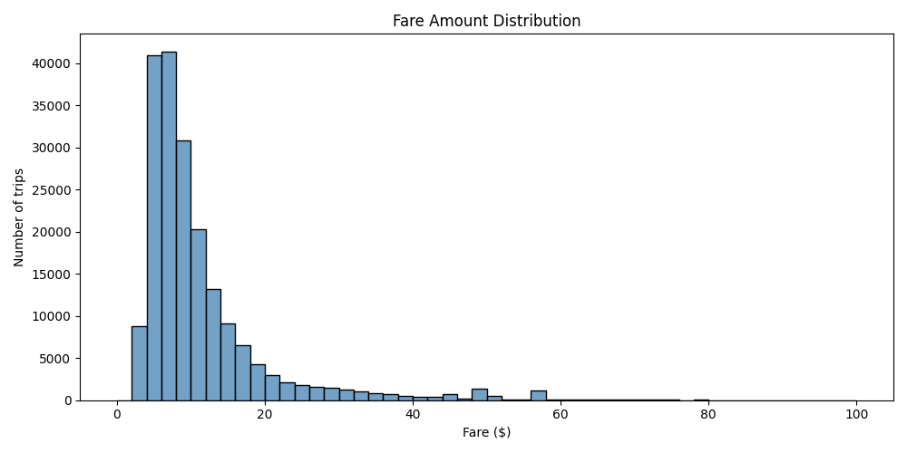
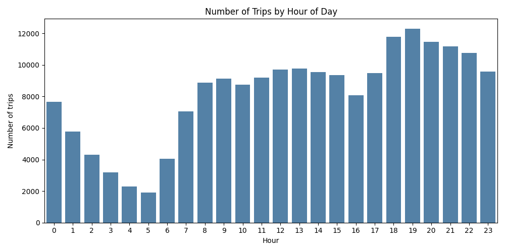
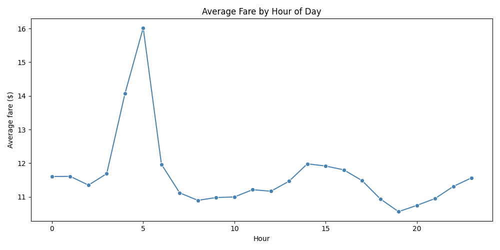
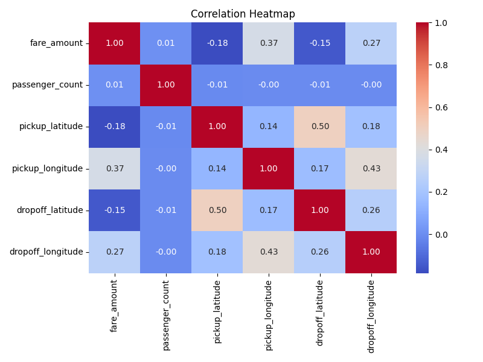

# Uber Fares - Data Cleaning & Analysis

Exploratory data analysis on the Uber Fares dataset from Kaggle, covering data cleaning, validation and profiling.

## Dataset

[Uber Fares Dataset](https://www.kaggle.com/datasets/yasserh/uber-fares-dataset) — ~200,000 Uber trips in New York City with fare prices, coordinates, timestamps and passenger count.

## Project structure

```
├── data_cleaning.py    # Data cleaning and validation
├── data_analysis.py    # Profiling and analysis
├── charts/                   # Generated charts
│   ├── fare_distribution.png
│   ├── trips_by_hour.png
│   ├── avg_fare_by_hour.png
│   └── correlation_heatmap.png
└── informe_uber.html         # Full profiling report (ydata-profiling)
```

## What each script does

**data_cleaning.py**
- Removes duplicate rows and useless columns
- Drops rows with null coordinates
- Filters out invalid fare amounts (≤ 0) and passenger counts (< 1 or > 6)
- Removes trips with coordinates outside New York City bounds
- Converts datetime column to proper format
- Applies min-max normalization to fare and passenger columns

**data_analysis.py**
- Generates a full HTML profiling report with ydata-profiling
- Detects outliers in fare_amount using the IQR method
- Extracts new features from the datetime column (hour, weekday, month)
- Analyzes average fare by hour and by passenger count
- Generates 4 charts: fare distribution, trips by hour, average fare by hour and a correlation heatmap

## Charts

### Fare Amount Distribution


### Trips by Hour of Day


### Average Fare by Hour


### Correlation Heatmap


## How to run

1. Download the dataset from Kaggle and place `uber.csv` in the project folder
2. Install dependencies:
```
pip install pandas numpy matplotlib seaborn ydata-profiling
```
3. Run the cleaning script first:
```
python data_cleaning.py.py
```
4. Then run the analysis:
```
python data_analysis.py
```

## Tech

Python 3 · pandas · matplotlib · seaborn · ydata-profiling